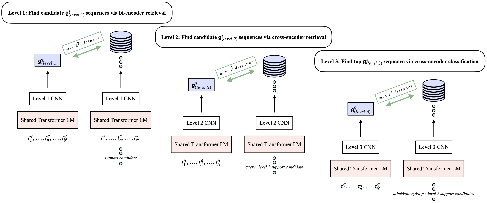

# memory_matching

This is the public repo for the forthcoming paper "Coarse-to-Fine Memory Matching for Joint Retrieval and Classification". The plan is to provide a refactored version of the codebase that also combines retrieval with the work in the separate publications introducing BLADE and multiBLADE, with a standardized interface for FEVER and other datasets, prior to formal publication (or shortly thereafter) of the final paper in the series. In the interim, I am releasing some of my raw research code in the directory [archive_research_code](archive_research_code), primarily as a point of contrast/comparison for researchers already familiar with non-parametric neural structures, since this paper includes a number of approaches that do not appear elsewhere. It can also be used for replicating the results of the paper. See [archive_research_code/README.md](archive_research_code/README.md) for additional information.

## Coarse-to-Fine Memory Matching for Joint Retrieval and Classification

## License

CC-BY-NC 4.0 (https://creativecommons.org/licenses/by-nc/4.0/)
